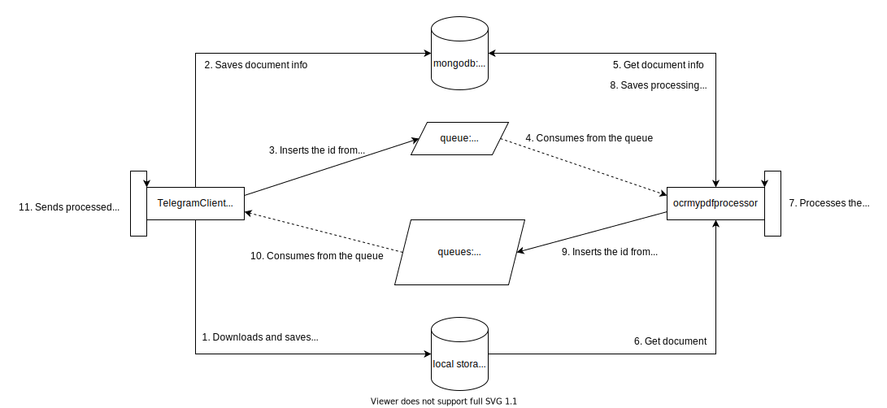

    
     
    <a href="https://t.me/@mf_ocr_bot"><strong>@mf_ocr_bot</strong></a> 
     

<h3 align="center"><strong>Pytonisa</strong></h3>

    A Telegram bot for applying OCR recognition to PDF documents.

## Pytonisa OCR bot

Pytonisa is a Telegram bot available for free (for as long as I have student credits on digital ocean) on Telegram at <a href="https://t.me/mf_ocr_bot"><strong>@mf_ocr_bot</strong></a>.

The name was choosen from a <a href="https://pt.wikipedia.org/wiki/P%C3%ADtia">Greek Oracle named Pitonisa</a> 

    <strong>Preview:</strong>
     
    
     
    <a href="https://www.youtube.com/watch?v=to0HWlrMVNw">https://www.youtube.com/watch?v=to0HWlrMVNw</a>

## Architecture

The project, as it is, was designed to run in a single computer since I only contracted one node on Digital Ocean. The more RAM and CPU, the better it will process (I recommend AT LEAST 2GB RAM).  

    <strong>Current architecture</strong>
     
    
     
    <a href="https://app.diagrams.net/"><strong>draw.io</strong></a> 
     
    You can use the above site to view/edit the architecture.drawio file

I may develop a solution for the cloud, with queue, database, ocrprocessor and telegram client dettached from each other. Maybe an API for accessing database and queue instead of accessing it directly.

## Instalation and execution

First, you must declare the following environment variables:

    TELEGRAM_API_ID=1234567
    TELEGRAM_API_HASH=aaaaaaaaaaaaaaaaaaaaaaaaaaaaaaaa
    TELEGRAM_BOT_TOKEN=aaaaaaaaaaaaaaaaaaaaaaaaaaaaaaaa-bbbbbbb-ccccc
    MONGO_INITDB_ROOT_USERNAME=admin
    MONGO_INITDB_ROOT_PASSWORD=admin

To get TELEGRAM_API_ID, TELEGRAM_API_HASH, you must go to https://my.telegram.org, under API Development.

To get TELEGRAM_BOT_TOKEN, you must talk to <a href="https://t.me/BotFather"><strong>@BotFather</strong></a>.

MONGO_INITDB_ROOT_USERNAME and MONGO_INITDB_ROOT_PASSWORD are arbitraty.

Then:

    docker-compose up --build

You may want to run the above command with the -d flag as well for running in the background

NOTE: I did not secure mongodb and rabbitmq for production deployment. I may do this in the future.

## Contributors

- Luís Chaves - Development
- Maria Fernanda Melgaço - Feedback and tests
- Isabele - Pytonisa drawing - <a href="https://www.instagram.com/izzy.m.f/">@izzy.m.f</a>